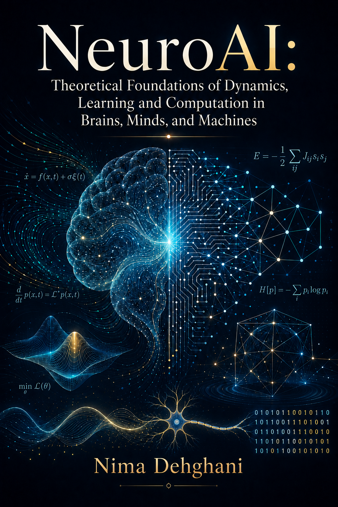

# NeuroAI

### Theoretical Foundations of Dynamics, 
Learning and Computation in Brains, Minds, and Machines

**Nima Dehghani**

 

## About this repository

This repository is the computational companion to *NeuroAI: Theoretical Foundations of Dynamics, Learning and Computation in Brains, Minds, and Machines* by Nima Dehghani. It contains the chapter-by-chapter code used for computational reconstructions, numerical experiments, analyses, and figures. 

The manuscript files are not hosted here. For each released chapter, the **arXiv** badge opens its abstract page and the **PDF** badge opens the chapter PDF directly.

**Author**  
[Nima Dehghani](mailto:nima.dehghani@mit.edu)  
McGovern Institute for Brain Research, Massachusetts Institute of Technology, Cambridge, Massachusetts, USA  
The NSF AI Institute for Artificial Intelligence and Fundamental Interactions (IAIFI), Cambridge, Massachusetts, USA

## Chapters and code releases

`☑` **released** &nbsp;&nbsp; `☐` **forthcoming**
Almost all chapters are written. It will take me some time to polish it to a clean document. But I promise to release them in a fairly fast pace.

### Foundations of NeuroAI

- ☐ **Chapter 1: NeuroAI—Subject, Method, and Boundary** &nbsp;  
- ☑ **Chapter 2: [Neural Logic, Invariance, and the Retina—McCulloch and Pitts](https://arxiv.org/abs/2609.02183)** &nbsp;  
- ☐ **Chapter 3: Learning a Decision Boundary—Rosenblatt and the Perceptron** &nbsp;  
- ☐ **Chapter 4: Amari—Neural Fields, Associative Dynamics, and the Geometry of Learning** &nbsp;  

### Memory, collective dynamics, and disorder

- ☑ **Chapter 5: [Memory as an Energy Landscape—Hopfield](https://arxiv.org/abs/2609.02195)** &nbsp;  
- ☐ **Chapter 6: Capacity and Disorder—Statistical Mechanics of Associative Memory** &nbsp;  
- ☐ **Chapter 7: Chaos in Random Neural Networks—Dynamic Mean-Field Theory** &nbsp;  

### Synapses and recurrent computation

- ☐ **Chapter 8: Abbott—Dynamic Synapses, STDP, Sequence Learning, and Multiscale Memory** &nbsp;  
- ☐ **Chapter 9: Abbott—Random Networks, FORCE Learning, and Population Computation** &nbsp;  

### Representation, learning, and inference

- ☐ **Chapter 10: Hinton—Boltzmann Machines, Backpropagation, and Distributed Representation** &nbsp;  
- ☐ **Chapter 11: Sejnowski—NETtalk, Infomax, and Independent Components** &nbsp;  
- ☐ **Chapter 12: Poggio—From Ill-Posed Vision to Compositional Intelligence** &nbsp;  
- ☐ **Chapter 13: Efficient, Sparse, and Predictive Coding—From Redundancy Reduction to Hierarchical Generative Inference** &nbsp;  

### Physical computation and biological scale

- ☐ **Chapter 14: When Does Matter Compute?—Physical Realization, Coarse-Graining, and Autonomous Closure** &nbsp;  
- ☐ **Chapter 15: What Does Recurrence Buy?—Temporal Irreducibility, Adaptive Reservoirs, and Compositional Motifs** &nbsp;  
- ☐ **Chapter 16: Where Does Biological Computation Live?—Scale, Cellular Information, and Effective Neural Theories** &nbsp;  

## Repository organization

Each released chapter has its own directory containing the corresponding code, generated data, and figure-reproduction material. Chapter-specific instructions, dependencies, and expected outputs are documented within that directory.

For book updates and additional material, visit [the official NeuroAI book website](https://neurovium.science/books/NeuroAI).
